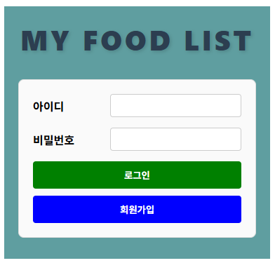
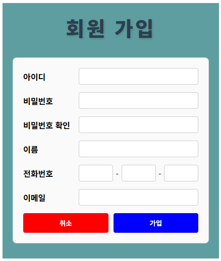
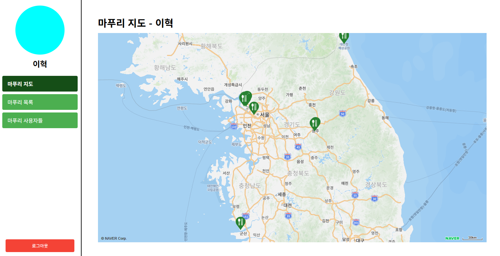
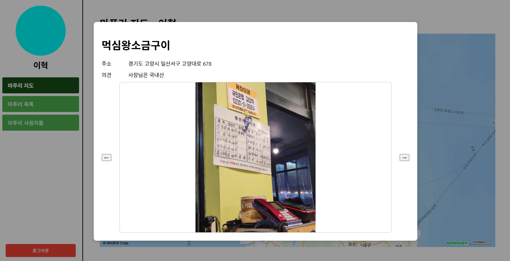
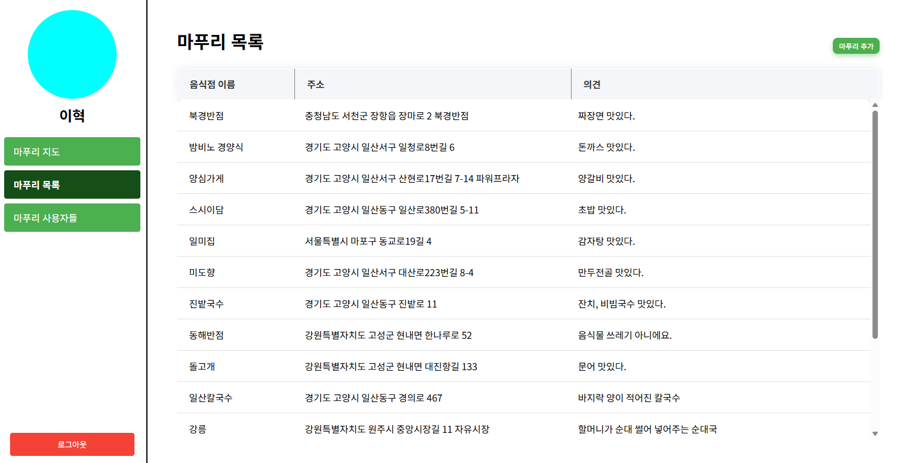
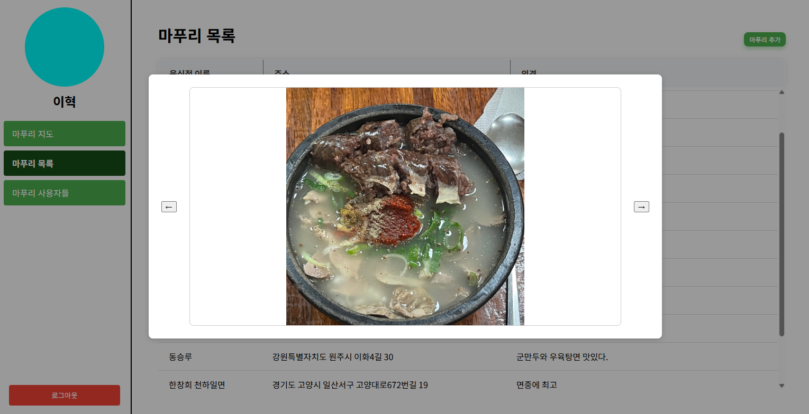
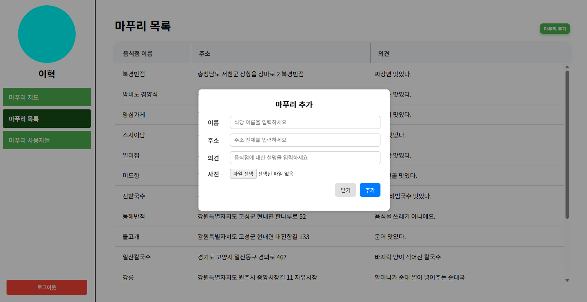
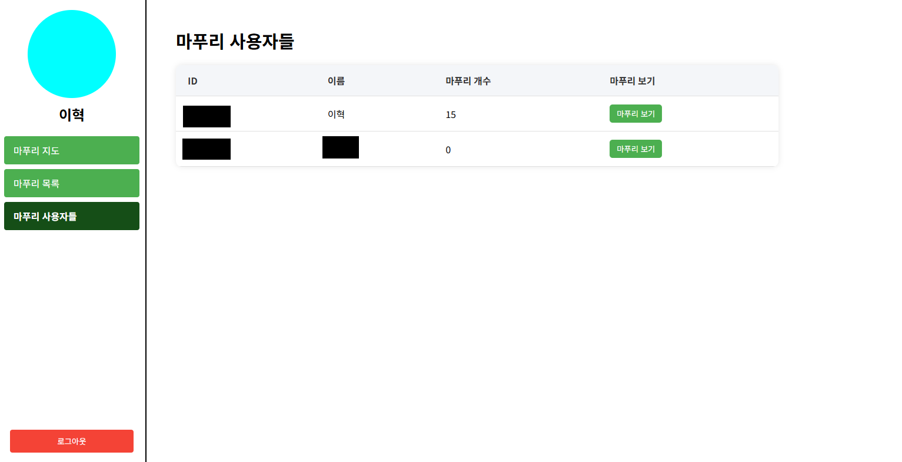

# My Food List Frontend

React 기반 프론트엔드

## React Version

19.1.0

## 환경변수(.env)

```env
PORT=포트번호네자리
```

## 화면 설명

1.  로그인

    로그인 시 아이디, 비밀번호를 입력한다.

    

2.  회원가입

    회원 가입 시 아이디, 비밀번호, 이름, 전화번호 이메일을 입력한다.

    

3.  메인(마푸리 지도)

    로그인 완료 시 나타나는 메인 화면

    추가한 마푸리의 마커들이 표시가 된다.

    

    마커를 클릭하게 되면 해당 마푸리의 정보가 다이얼로그로 나타난다.

    

4.  마푸리 목록

    마푸리가 나온다.

    

    마푸리 클릭 시 해당 사진이 나타난다.

    

    "마푸리 추가" 버튼으로 마푸리 추가가 가능하다.

    정보를 입력 후 사진은 여러장 추가가 가능하다.

    

5.  마푸리 사용자들

    마푸리 사용자들의 목록이 나타난다.

    원하는 사용자의 "마푸리 보기" 버튼을 클릭하면 마푸리 지도에 선택한 사용자의 마푸리가 마커로 나타난다.

    
